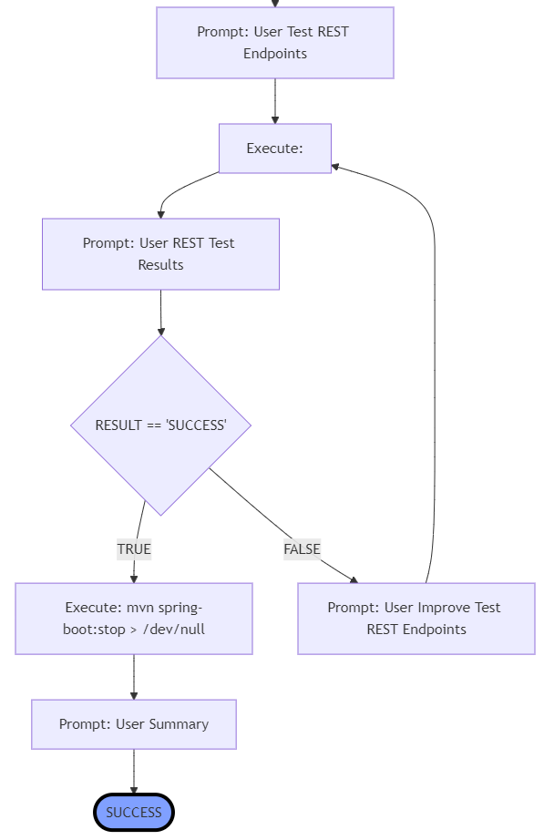
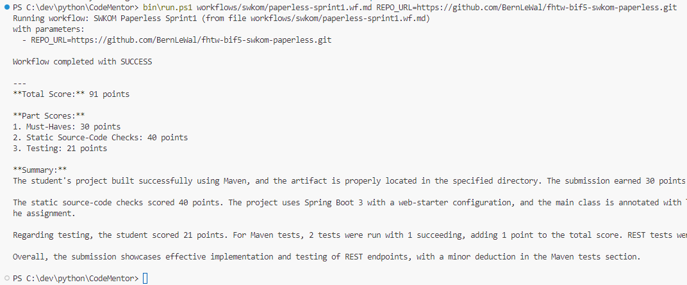

# AI Code Mentor

AI Code Mentor is a **runtime environment** designed for building applications with **integrated autonomous AI agents**. These applications are defined as **workflows**, written in Markdown files (`.wf.md`), which are interpreted and executed by the Code Mentor system.

The AI agents (multiple instances are supported) generate and execute commands (e.g., Bash shell commands) directly, feeding the output back to the AI for analysis and iteration. This allows AI agents to **self-improve their tasks** when necessary. Currently, OpenAI's platform is integrated, with plans to add alternative AI models in the future.

## Features & Benefits

### Key Features
- **Local Execution**: Data remains local and is processed inside a **Docker container**, avoiding unnecessary cloud uploads.
- **Autonomous Execution**: AI-generated commands are executed automatically within the container, eliminating the need for manual copy-pasting.
- **Multi-Agent Support**: Multiple AI agents can operate simultaneously within the same workflow, distributing tasks efficiently.
- **Structured Workflow Definition**: Workflows define clear goals, paths, branches, and alternative solutions, providing better AI context compared to free-text prompting.
- **Scalability & Automation**: Execute workflows on multiple targets, e.g., grading 100+ source code submissions automatically.
- **Traceability & Transparency**: All AI-generated commands and their results are logged, providing visibility into the execution process.

<!--ChatGPT's **Canvas is still limited**. It can execute commands also, but will do that in the cloud and is limited (currently) when it comes to deal with multiple files and complex execution environments.-->

### Example Use Case: Automatic Grading of Software Development Assignments

AI Code Mentor enables **autonomous evaluation of source code projects** based on program requirements and specifications. The AI agents:
1. Analyze student submissions.
2. Provide feedback.
3. Assign grades automatically.
4. Iterate if necessary to refine evaluations.

This is particularly useful for software development educators, reducing manual grading effort while maintaining fairness and transparency.  
For more details see [AI CodeMentor – Automating the Evaluation of Programming Assignments](./docs/pitch/educators-pitch.md).

---

## Screenshots

### Workflow Execution for a REST Service Evaluation


### Console Output of an AI Code Mentor Run


---

## Implementation Status

🚀Latest News in version: 0.1.6
- Added local running AI-Agents support (Huggingface Transformers LLMs) 
- Added **batch-processing**, e.g. to run benchmarks
- AI-Agent configuration **parameters** support, e.g temperature, n_top, f_penalty,..
- AI-Agent **telemetry** recording, e.g. tokens used, duration, iterations
- added **Google Gemini** and **Anthropic Claude**  (as AI-Agents) support

Version history see [app/version.py](./app/version.py)

### Comming Enhancements
- add separate statistics object for workflow runner
- **create agent** instead of "Prompt: System"
- Enhance AI agent feedback loops for **self-improvement**: Adapt temperature Setting: start with 0, increase on IMPROVE path
- Workflow Validation
- Implement command execution **whitelists/blacklists** and a reputation mechanism for security.
- Develop a **collaboration model** for AI agents.

### Future Ideas
- Implement **PLaG** technique (see [docs/literature/PLaG.md](./docs/literature/PLaG.md)) as a sample - should fit perfectly to CodeMentor
- Introduce a **server mode with a REST API** (eliminating volume mount dependencies).
- CodeRunner Integration? (as docker-container)

---

## Research Questions

### 1. How can AI Code Mentor achieve **full AI autonomy**?
- Follow Google's [AI Agent definition](https://www.kaggle.com/whitepaper-agents):
  - Integration with **external systems**.
  - **Session-based interactions** with multi-turn inference.
  - **Native tool integration** within the AI agent architecture.
  - AI agents **learn from feedback** without external intervention.

### 2. How does AI-driven software development differ from traditional methods?
- AI-generated output is inherently **non-deterministic**, requiring flexible error-handling mechanisms.
- Unlike structured programming, AI-driven execution lacks **formal grammars**, requiring **robust parsers** for interpreting agent outputs.
- AI-generated outputs should be **iteratively improved** rather than statically parsed.

---

## Usage

### Prerequisites
- Install **Docker**: [Get Docker](https://www.docker.com/products/docker-desktop)
- You need to create an account and credentials on the cloud AI vendor of your choice (e.g. OpenAI, Google or Anthropic): see [docs/setup.md](docs/setup.md)
- If you want to run the local AI-agents on your CUDA environment, see [docs/setup_cuda.md](docs/setup_cuda.md)
- Create an .env file in the docker/ directory, based on the [docker/.env.sample](./docker/.env.sample) file.

### Running AI Code Mentor

**Linux:**
  ```sh
  bin/run_codementor.sh [options] <workflow-file.md> [<key=value> ...]
  ```
**Windows:**
  ```powershell
  bin\run_codementor.ps1 [options] <workflow-file.md> [<key=value> ...]
  ```
For more details, see [bin/README.md](bin/README.md).

### Command-Line Options:
| Option | Description |
|--------|-------------|
|-h, --help | Show help message |
|-v, --version | Display version info |
|--verbose | Show log output in console |

### Arguments:
- ```<workflow-file.md>```: Markdown file defining the workflow (e.g., [workflows/check-toolchain.wf.md](workflows/check-toolchain.wf.md)).
- ```[<key=value> ...]```: Optional key-value parameters passed to the workflow.

### Example Execution
Run the check-toolchain workflow with a specific REPO_URL:

**Linux:**
  ```sh
  bin/run_codementor-java.sh workflows/check-toolchain.wf.md REPO_URL=https://github.com/BernLeWal/fhtw-bif5-swkom-paperless.git
  ```

**Windows:**
  ```powershell
  PS > bin\run_codementor-java.ps1 workflows/check-toolchain.wf.md REPO_URL=https://github.com/BernLeWal/fhtw-bif5-swkom-paperless.git
  ```
⚠️ **Note**: Path parameters must use forward slashes (```/```) since the application runs in a Linux-based environment.

### Logging
- The console (```stdout```/```stderr```) is reserved for CLI output.
- Logs are stored in: [log/codementor.log](log/codementor.log)
- Docker logs remain empty unless running with ```--verbose``` or in ```--server``` mode.


### Create your own Workflows

See the [docs/tutorial](./docs/tutorial/README.md) to get started with creating your own worklfows

---

## Contents

```
.
├── app                         # The CodeMentor sources (Python)
├── artwork                     # Logos, etc.
├── bin                         # Scripts to run (and build) the CodeMentor
├── docker                      # Docker-Environment in which the CodeMentor will run
│   ├── codementor              # - CodeMentor can execute BASH (and Python) commands
│   └── codementor-java         # - CodeMentor can execute BASH commands and has a Java21+Maven environment
├── docs                        # Documentation
├── log                         # AI CodeMentor will output the application logs into that directory
├── output                      # AI CodeMentor will output the trace-files here, for detailed investigations
├── test                        # Unit-Tests for the Python application
└── workflows                   # Contains the workflow files, which AI CodeMentor will execute
```

---

## Development

### Setup

**Install Python & Dependencies**
  ```sh
  sudo apt install python3 python3-pip -y
  pip install virtualenv
  python -m virtualenv .venv
  source .venv/bin/activate
  pip install -r requirements.txt
  ```

### Running & Debugging

1. Set ```PYTHONPATH``` before running:

    - Linux (Bash):
      ```sh
      export PYTHONPATH=$(pwd)
      ```

    - Windows (PowerShell):
      ```powershell
      $env:PYTHONPATH = (Get-Location).Path
      ```

2. Run the application with a workflow file:

    ```sh
    python app/main.py workflows/check-toolchain.wf.md
    ```

3. Help & Usage:

    ```sh
    python app/main.py -h
    ```

4. Run the Test-Suite
  
    Pytest is used to run the unit-tests, start it from the project root directory:
    ```sh
    pytest
    ```

### Sample Workflow Execution

```sh
python app/main.py workflows/source-eval/paperless-sprint1.wf.md REPO_URL=https://github.com/BernLeWal/fhtw-bif5-swkom-paperless.git
```

---

## Documentation

For software architecture and implementation details, see [docs/README.md](docs/README.md).

User documentation and Tutorials are here: [docs/tutorial](./docs/tutorial/README.md).

---

## License

This project is licensed under the **[AGPLv3](./LICENSE)** open-source license.
