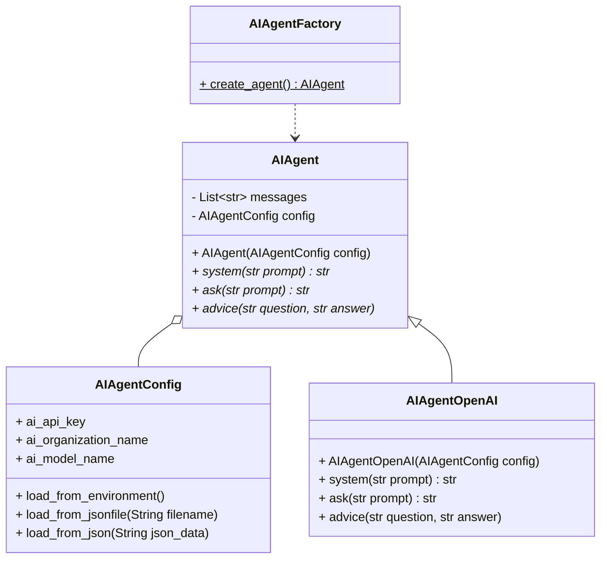
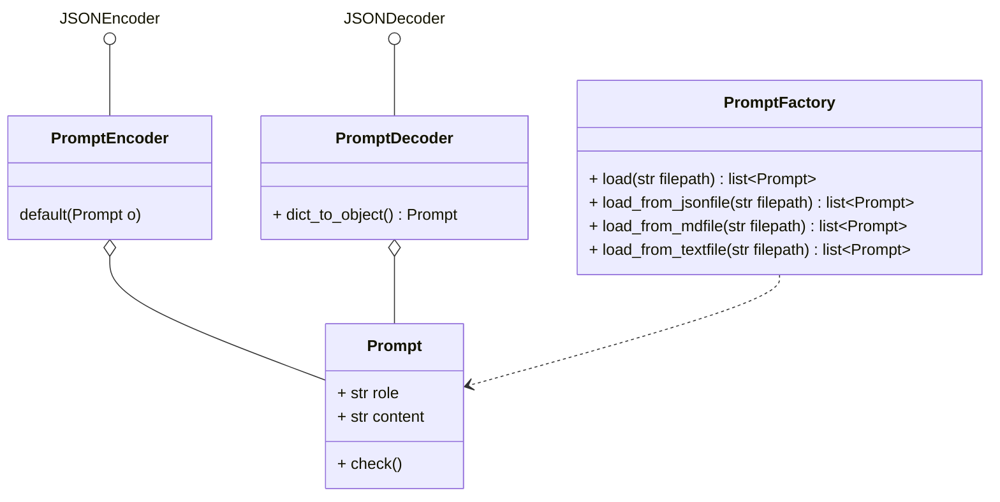

# AI-Agents

Classes respresenting the AI-Agents which will work on the tasks using chat completion.
The decision which AI-Technology/-Platform in which configuration to select is taken flexible on the time of AI-agent instance creation done by the AIAgentFactory.

# AI-Agent Classes

## Prompt Classes
