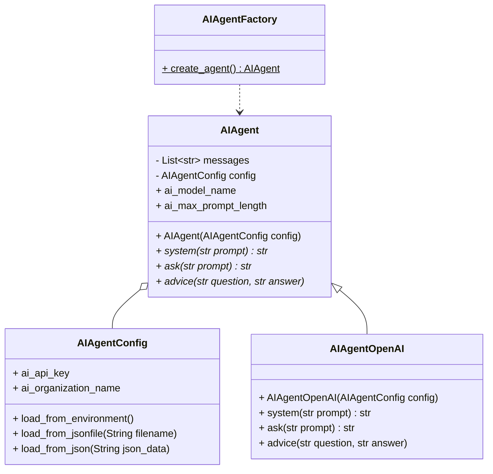
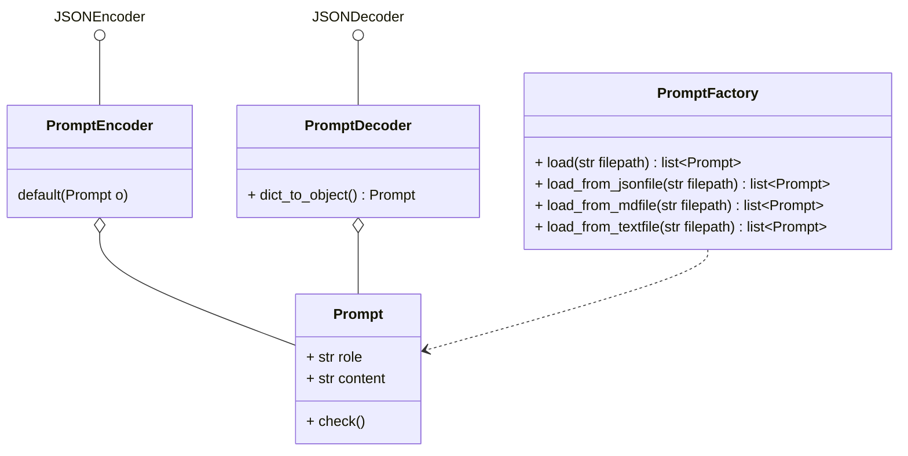

# AI-Agents

## Introduction 

This application implements autonomous AI-Agents, which is **AI-autonomous level 2**: An (limited) autonomous actor with defined goals and tasks. It interacts with technicians who perform similar tasks (see Jörg Neumann, Neno Loje; BASTA! Konferenz 2023)

## "Agents" whitepaper (published by Google)
Five Key Takeaways from "Agents" published by Google (compiled by Sacha Ghiglione): 
1. Agents are AI on steroids: They go beyond basic models by 
    - **using tools**, 
    - **making plans**, 
    - and **taking actions**—more like humans solving problems.
2. It’s all about the setup: To work, agents need three things: 
    - a **smart model** for decisions, 
    - **tools to interact** with the real world, 
    - and a **system to manage** how they plan and act.
3. **Tools make all the difference**: APIs, databases, and real-time data give agents superpowers to move beyond just answering questions—they can actually do things.
4. **Building agents is getting easier**: Platforms like LangChain and Vertex AI make it simple to create and deploy agents, even for complex tasks.
5. **There’s still work to do**: Big challenges like making agents easy to use, interoperable, and privacy-friendly need solving before they truly take off.

Reference: [*Agents* published by Google](https://www.kaggle.com/whitepaper-agents)

## AI-Agents versus LLM

The AI-Agents in this solution differs from just LLM models like used in ChatGPT.

| **Models** | **Agents** |
|------------|------------|
| Knowledge is limited to what is available in their training data. | Knowledge is extended through the **connection with external systems** via tools. |
| Single inference/prediction based on the user query. Unless explicitly implemented for the model, there is no management of session history or continuous context. (i.e., chat history) | Managed session history (i.e., chat history) to allow for **multi-turn inference/prediction** based on user queries and decisions made in the orchestration layer. In this context, a ‘turn’ is defined as an interaction between the interacting system and the agent. (i.e., 1 incoming event/query and 1 agent response) |
| No native tool implementation. | **Tools are natively implemented** in agent architecture. |
| No native logic layer implemented. Users can form prompts as simple questions or use reasoning frameworks (CoT, ReAct, etc.) to form complex prompts to guide the model in prediction. | Native cognitive architecture that uses reasoning frameworks like CoT, ReAct, or other pre-built agent frameworks like LangChain.  |

## AI-Agents one of topmost breaktrough technologies in 2025 (IEEE)

IEEE's team of experts forsees 22 breaktrough technologies set to redefine industries and shape the future of our world for decades to come. AI-Agents are rated on 3rd place (after LLMs and Drone Adoption) of the most important technologies, get the report from https://www.computer.org/resources/2025-top-technology-predictions

The following section is an excerpt from the report:

*"AI agents combining LLMs, ML models, and rule-based systems will provide autonomous, highly specialized  solutions for finance, manufacturing, and retail operations."*

Problems/Demands:
- Repetitive task requiring low level of expert knowledge and/or creativity, can be performed by AI agent
- Challenges to scale up small business due to inability to hire skilled workers to perform specific tasks
- Users should be able to interact with AI agents in their preferred human language, including flexible or informal expression
- Enabling AI agents to automatically generate and deliver relevant content based on a given context or subject

Opportunities:
- AI agents will **enable automation of more complex tasks with minimal human input**, requiring only task descriptions
- **Work efficiency will increase** as some tasks will be performed faster by AI agents than humans with less error
- **Enabling small businesses to scale up** without the need to hire more skilled workers
- AI agents will **create new job opportunities** centered around their development and maintenance.
- Guidance of AI agent development of their own logic in suitable directions
- Have AI agents as allies and even drivers in the development of sustainable activities
- **Education can become more accessible and personalized** through AI agent tutors

Impact:
- **Jobs will evolve** as AI agents take on certain specialized tasks, creating opportunities for new roles
- The **need for upskilling will grow** as some jobs fade, while others evolve into active collaborations with AI agents to achieve desired outcomes
- Increased training for workers on effectively collaborating with AI agents
- **Small businesses will scale faster** by deploying AI agents, reducing the need for extensive labor investments

Sustainable solutions / business opportunity:
- Solutions with a friendly user interface to interact with AI agents
- AI agents will enable sustainable solutions by performing specific roles or assisting humans, promoting efficient and responsible practices
- AI agents to drive trends to sustainability

**Enablers**: 
- advancement of small language models will lower hardware requirements and enable easier finetuning
- open-source AI libraries and models will allow for model and data ownership
- cloud solutions with friendly user interface and low code approach will increase the accessibility of AI agent solutions

**Inhibitors**: 
- data quality and preparation will remain important for quality solutions
- limited computational resources and energy costs can hinder progress
- challenge from LLM hallucinations generating inaccurate information 
- potential loss of employment
- risks related to AI agents developing their own logic

---

# AI CodeMentor - Agent Architecture

## AI-Agent Classes

Classes respresenting the AI-Agents which will work on the tasks using chat completion.
The decision which AI-Technology/-Platform in which configuration to select is taken flexible on the time of AI-agent instance creation done by the AIAgentFactory.

## Prompt Classes
