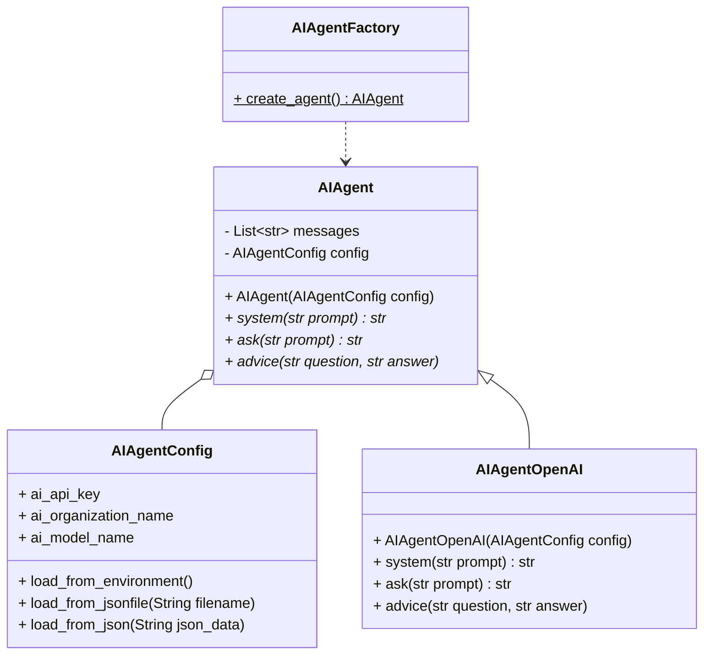
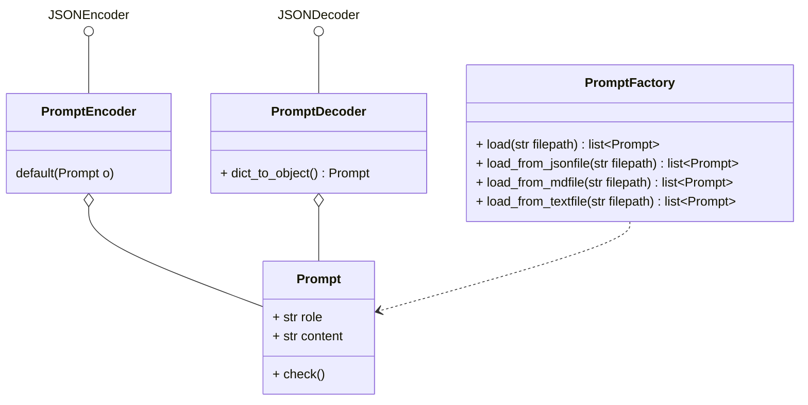

# AI-Agents

This application implements autonomous AI-Agents, which is **AI-autonomous level 2**: An (limited) autonomous actor with defined goals and tasks. It interacts with technicians who perform similar tasks (see Jörg Neumann, Neno Loje; BASTA! Konferenz 2023)

The AI-Agents in this solution differs from just LLM models like used in ChatGPT.

| **Models** | **Agents** |
|------------|------------|
| Knowledge is limited to what is available in their training data. | Knowledge is extended through the **connection with external systems** via tools. |
| Single inference/prediction based on the user query. Unless explicitly implemented for the model, there is no management of session history or continuous context. (i.e., chat history) | Managed session history (i.e., chat history) to allow for **multi-turn inference/prediction** based on user queries and decisions made in the orchestration layer. In this context, a ‘turn’ is defined as an interaction between the interacting system and the agent. (i.e., 1 incoming event/query and 1 agent response) |
| No native tool implementation. | **Tools are natively implemented** in agent architecture. |
| No native logic layer implemented. Users can form prompts as simple questions or use reasoning frameworks (CoT, ReAct, etc.) to form complex prompts to guide the model in prediction. | Native cognitive architecture that uses reasoning frameworks like CoT, ReAct, or other pre-built agent frameworks like LangChain.  |

Reference: [*Agents* published by Google](https://media.licdn.com/dms/document/media/v2/D561FAQH8tt1cvunj0w/feedshare-document-pdf-analyzed/B56ZQq.TtsG8AY-/0/1735887787265?e=1736985600&v=beta&t=pLuArcKyUcxE9B1Her1QWfMHF_UxZL9Q-Y0JTDuSn38)

# AI-Agent Classes

Classes respresenting the AI-Agents which will work on the tasks using chat completion.
The decision which AI-Technology/-Platform in which configuration to select is taken flexible on the time of AI-agent instance creation done by the AIAgentFactory.

## Prompt Classes
