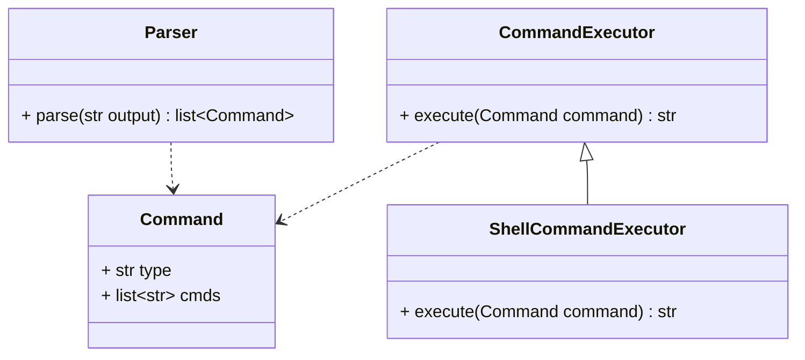

# Commands

Classes to parse commands from agents outputs and execute them in a safe manner

## Command Classes

```mermaid
classDiagram
    class Parser {
        + parse(str output) list~Command~
    }
    Parser ..> Command

    class Command {
        + str type
        + list~str~ cmds
    }

    class CommandExecutor {
        + execute( Command command ) str
    }
    CommandExecutor ..> Command

    class ShellCommandExecutor {
        + execute( Command command ) str
    }
    CommandExecutor <|-- ShellCommandExecutor
```
