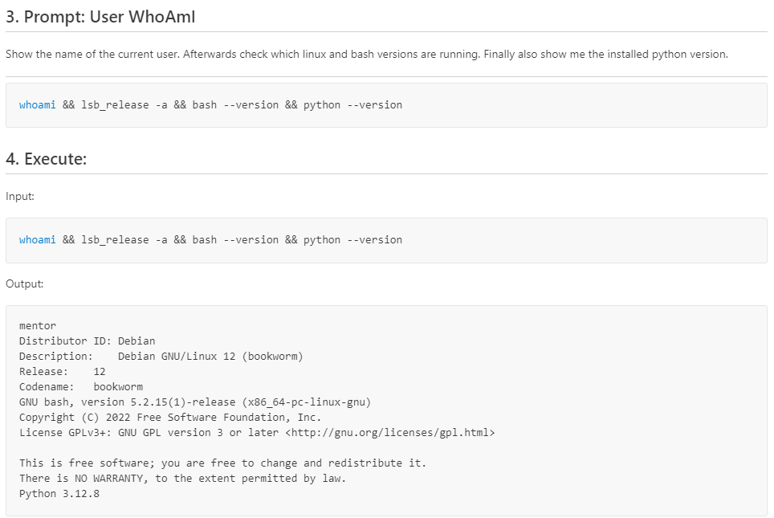

# LinkedIn "Hands-On AI-Agent Series"

## **What is an AI Agent?** 🧠🤖  

Artificial Intelligence (AI) is rapidly evolving, and one of the most exciting advancements is the concept of **AI Agents**—autonomous software entities that can independently execute tasks to achieve defined goals. But how autonomous are they really?  

According to Jörg Neumann and Neno Loje (BASTA! Conference 2023), an AI agent operates at **Autonomy Level 2**, meaning it can act independently within certain limits. But what does that mean in practical terms? Let’s take a hands-on look!  

---

## **Can an AI Agent Execute System Commands?**  

A true AI agent must not only generate responses but also **interact with external systems**. One fundamental capability is executing shell commands to **analyze its environment**—a crucial step for AI-driven automation and decision-making.  

Sounds complex? It’s actually quite straightforward!  

In **AI CodeMentor**, I demonstrate this step-by-step in the [Getting Started - Tutorial 2](https://github.com/BernLeWal/AICodeMentor/blob/main/docs/tutorial/lesson2.md). Here’s the challenge:  

> *The AI agent must determine its runtime environment by issuing and analyzing system commands.*  

This requires three key steps:  
✅ **Generating the required system commands** (via prompt-based AI interaction)  
✅ **Parsing and classifying the output** (to identify which system to be used)  
✅ **Executing the commands and analyzing the results**  

A simple Workflow flowchart (which is the way AICodeMentor is "programmed") illustrates this process:  

To ensure reliability, **all outputs from STDOUT and STDERR are stored**, allowing the agent to process them in follow-up prompts. This enables the agent to evaluate its own actions and adjust its behavior accordingly—bringing it one step closer to true autonomy.  

---

## Results: AI Agent in Action ⚡

After executing this workflow in **AI CodeMentor**, the final output looks like this:

This demonstrates the power of AI-driven automation. Instead of manually looking up system commands, opening a shell, and running them, the AI agent does everything for you—retrieving and presenting the exact system information you need **autonomously**.

🚀 **No need for manual command-line interaction—just let the AI agent handle it!**

---

## **What’s Next?** 🚀  

This is just the beginning of my **Hands-On AI Agents** series. In the next article, we’ll dive deeper into 
**iterations for the AI-Agent to improve the results towards a high-level goal**

🔗 **Explore the code and try it yourself**: [GitHub: AI CodeMentor](https://github.com/BernLeWal/AICodeMentor)  

💬 **What’s your experience with AI agents? Have you experimented with executing system commands using AI? Let’s discuss in the comments!**  

