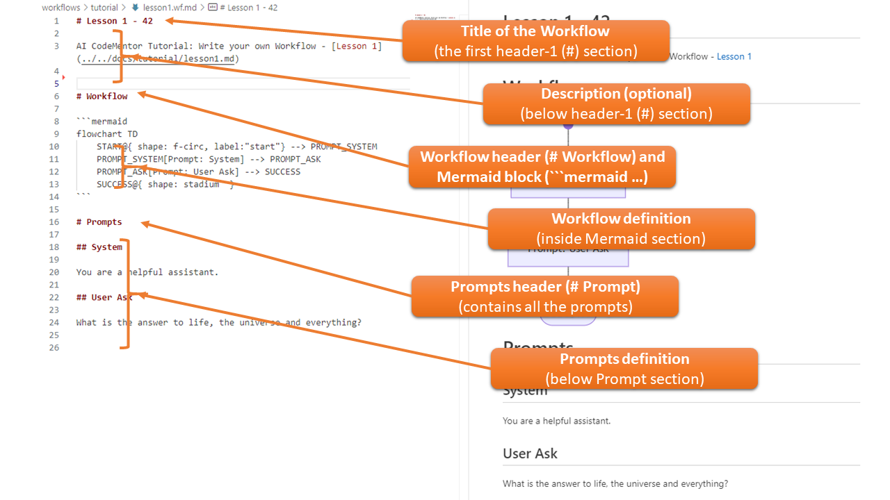

# AI CodeMentor - Tutorials: Getting Started

## Lesson 1: Your First Workflow

Let's explore a simple and structured example to understand the format required for an AI CodeMentor-compatible Markdown file.

- See the full source file: [workflows/tutorial/lesson1.wf.md](../../workflows/tutorial/lesson1.wf.md)
- Because the Markdown file **must** follow a fixed structure, the file extension is `.wf.md`.

### Workflow File (.wf.md) - Structure



The file consists of the following sections:

- **Title**: Any title defined at the first header-1 (`#`) section.  
  **Example:** `# Lesson 1 - 42`
- **Description**: Any Markdown content that describes the workflow. This section is optional and will not be used by CodeMentor.  
  **Example:** `AI CodeMentor Tutorial: ...`
- **Workflow**: The header-1 section named `# Workflow` marks where activities are defined in a flowchart diagram.
- **Workflow Definition**: Defined using the Mermaid Flowchart Diagram syntax.  
  This example contains the following four steps, executed in a linear sequence from `START` to `SUCCESS`:

| Step | Name | Description |
|------|------|------------|
| 1 | **START** | The starting point of every workflow. Defined as `START` in Mermaid syntax. |
| 2 | **PROMPT_SYSTEM** | Sends a system prompt to the AI-Agent. Must start with `PROMPT_` and have a caption beginning with `Prompt:`. |
| 3 | **PROMPT_ASK** | Sends a user-specific prompt. Named `User Ask` in this example. Leads to `SUCCESS`. |
| 4 | **SUCCESS** | The mandatory endpoint of every workflow. |

- **Prompts**: The header-1 section `# Prompts` defines the prompts used in the workflow. Separating prompts from the flowchart allows for better readability and reusability.
- **Prompt Definitions**: This section contains multiple prompt definitions. In this example:
  1. **System Prompt** (`## System`) – Used to create a new AI-Agent and set the system context.
  2. **User Prompt** (`## User Ask`) – Must start with `## User ` followed by a title.

### Running the Sample

You can now execute the workflow using the following commands:

#### Windows
```shell
bin\run_codementor.ps1 workflows/tutorial/lesson1.wf.md
```

#### Linux
```shell
bin/run_codementor.sh workflows/tutorial/lesson1.wf.md
```

#### Expected Output
The system will process the workflow and return an AI-generated response. Example output:

```
The answer to life, the universe, and everything is famously stated as "42" in Douglas Adams' science fiction series "The Hitchhiker's Guide to the Galaxy." This humorous response has become a popular cultural reference, symbolizing the search for meaning in life.
```

✅ **Congratulations!** You've successfully executed your first AI CodeMentor workflow.

### What's Next?
Now that you've executed your first workflow, try the following:

- Modify the workflow file (`lesson1.wf.md`) and observe the changes.
- Add an additional prompt step in the workflow.
- Continue to **[Lesson 2](lesson2.md)** to explore more advanced features of AI CodeMentor.
