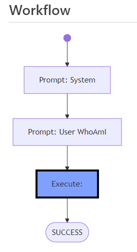

# AI CodeMentor - Tutorials: Getting Started

## Lesson 2: Let the AI-Agent Execute Your First Commands

During workflow execution, the result of each activity is stored in a variable called *RESULT*. This variable serves as the context for subsequent activities. To make the AI-Agent execute commands automatically, it must be prompted to generate these commands, which will then be stored in the *RESULT* variable.

In this lesson, the workflow will be extended with an **EXECUTE_** activity. This activity extracts commands from the current *RESULT*, classifies them (e.g., as BASH shell commands), and executes them. The command output—including messages sent to **STDOUT** and **STDERR**—will be stored in the *RESULT* variable accordingly.

- See the full source file: [workflows/tutorial/lesson2.wf.md](../../workflows/tutorial/lesson2.wf.md)

These results must be sent back to the AI-Agent to help it recognize what happened and incorporate this information for further processing. To achieve this, a **PROMPT_** activity must follow.

---

## Workflow Activities

The `# Workflow` section of the file now contains the following activities:

1. **START**  
   The **START** activity must exist in every workflow as the entry point. It is connected to the next activity, **PROMPT_SYSTEM**, using `"-->"` notation.

2. **PROMPT_SYSTEM**  
   All activities whose names begin with **"PROMPT_"** send prompts to the AI-Agent. The caption for this activity must start with `"Prompt: "`. This activity sets the system prompt for the AI-Agent and then moves to **PROMPT_WHOAMI**.

3. **PROMPT_WHOAMI**  
   This activity sends a user prompt titled `"User WhoAmI"` (the text following `"Prompt: "` in the caption). The prompt is loaded from the prompt definitions below. This activity then leads to **EXECUTE_OUTPUT**.

4. **EXECUTE_OUTPUT**  
   Activities beginning with **"EXECUTE_"** execute commands. The **EXECUTE_OUTPUT** activity extracts commands from the previous *RESULT* (generated by **PROMPT_WHOAMI**) by scanning the `` ``` `` code blocks in the Markdown text. These commands are then parsed, classified (e.g., as BASH shell commands), and executed within the AI CodeMentor runtime environment, which is provided via a Docker container.
   
   **Important:** The caption must start with `"Execute: "`. If you want to use predefined commands instead of extracting them from *RESULT*, append them directly after `"Execute: "` (not used in this lesson).

   This activity proceeds to **SUCCESS**.

5. **SUCCESS**  
   The **SUCCESS** activity marks the end of the workflow and **must** be defined exactly as shown in the example. It prints the final *RESULT*.

---

## Prompts

Prompts prepare the AI-Agent to generate commands for the given tasks. These are defined in the `## Prompts` section of the workflow file.

### System Prompt:
```
You are a helpful assistant.

You will generate shell commands for the specified tasks, which will be executed directly in a Linux container provided with the necessary command-line tools.

Generate the commands in shell code blocks and always provide only one alternative per chat-completion result.
```

### User Prompt (WhoAmI):
```
Show the name of the current user.
Afterwards, check which Linux and Bash versions are running.
Finally, also show me the installed Python version.
```

---

## Running the Workflow

You can now execute the workflow using the AI-CodeMentor Web Frontend:

- Ensure, that it is started, see [docker/codementor/README.md](../../docker/codementor/README.md)
- Use the simple Web-UI to get started: http://localhost:5000/
  - **Login** into the AI-Codementor: http://localhost:5000/auth?token=<SERVER_TOKEN>
  - Use the **Workfile Explorer**: http://localhost:5000/files
  - Navigate to 'tutorial' subdirectory, 
  - click on [Play]-button right beside `lesson1.wf.md`

Expected output:
```
$ whoami && lsb_release -a && bash --version && python --version
mentor
Distributor ID:	Debian
Description:	Debian GNU/Linux 12 (bookworm)
Release:	12
Codename:	bookworm
GNU bash, version 5.2.15(1)-release (x86_64-pc-linux-gnu)
Copyright (C) 2022 Free Software Foundation, Inc.
License GPLv3+: GNU GPL version 3 or later <http://gnu.org/licenses/gpl.html>

This is free software; you are free to change and redistribute it.
There is NO WARRANTY, to the extent permitted by law.
Python 3.12.8
```

---

## Tracing and Debugging the Workflow

Each time AI CodeMentor executes a workflow, it records traces for every activity and its respective result in a **workflow history file** (`.wfh.md`). This file is stored in the [log/<timestamp>/](log/) directory.

The format of `.wfh.md` is similar to `.wf.md`, but it includes an additional `# History` section where the status and results of all activities are logged.

**Tip:** The history file can be opened **while** the workflow is still running. The **current activity** will be highlighted in **blue**, allowing for real-time monitoring and debugging.

See the sample history file: [workflows/tutorial/lesson2-output.wfh.md](../../workflows/tutorial/lesson2-output.wfh.md)

<center>



</center>

---

🎉 **Congratulations!** Your AI-Agent has successfully executed its first set of commands automatically.

### What's Next?
Now that you've executed your first commands, try the following:

- Modify the workflow file (`lesson2.wf.md`) and observe the changes.
- Add an additional prompt step after the execute-activity and use the execution's results.
- Continue to **[Lesson 3](lesson3.md)** to explore more advanced features of AI CodeMentor.
