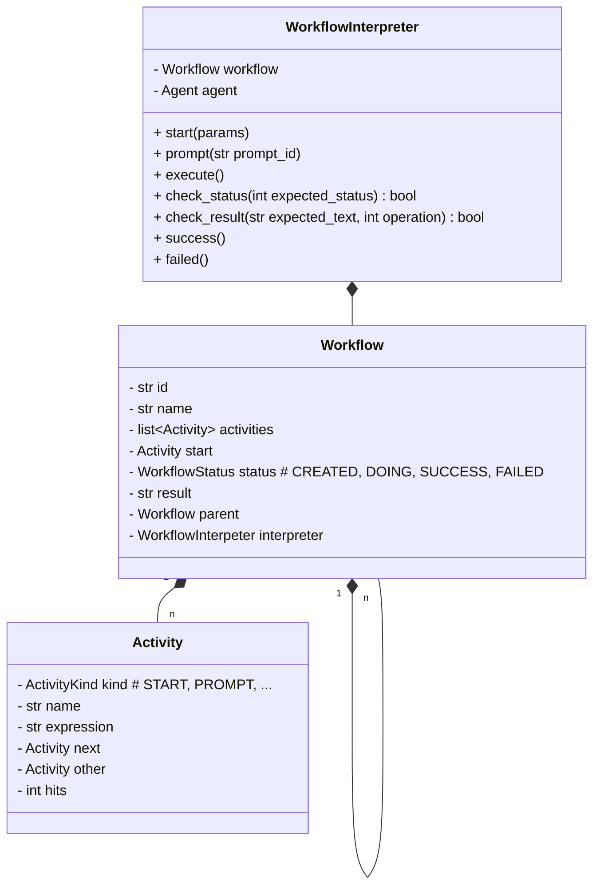
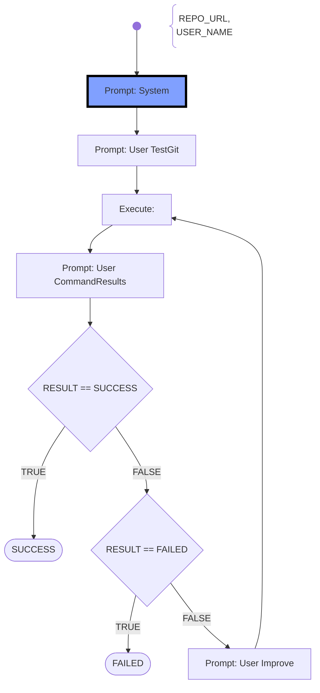

# Workflow

- A **Workflow** is started by an objective given from the user, e.g. grade a student submission
- The **Workflow** consists of multiple activities which will be run like a flow-diagram (divide and concquer)
- Possible tasks are: start, create agent (returns an agent), prompt agent (returns the agent's output), execute commands, checkpoint, finish
- A **Workflow** may use sub-**Workflow**s
- Within a workflow AI-agents use the tool-chain (**CommandExecutors**), colloberate to each other, and with the user (if required)
- The **WorkflowInterpreter** provides the shared context between all AI-agents, the tool-chain, and the user for collaboration
- The **WorkflowInterpreter** controls the execution of the collaboration, executes the parties (AI-Agents, Commands), checks the overall status of tasks and the workflow, and interrupts/fails the workflow on problems
- The **WorkflowInterpreter** will limit the collaboration due to, cost limits of AI-APIs, char/token limits, time limits, and iteration limits

## Class Diagram

## Workflow Interpretion

- A workflow consists of a list of **Activities**
- Every Activity is of a special **ActivityKind** which describes the actions to take place
- Every workflow has a **START** Activity, which must be included in the flow-chart
- Every workflow has a **SUCCESS** Activity, which does not need to be shown in the flow-chart. When the current activity has no next-activity defined, then automatically the **SUCCESS** Activity is reaced next.
- Every workflow has a **FAILED** Activity, which does not need to be shown in the flow-chart. When there is an error during activity running or the failed-activity in the **CHECK** activity is to be taken but not connected, then the **FAILED** Activiy is automatically reached next.
- Running the **SUCCESS** or **FAILED** activities will end the Workflow interpretation which the corresponding SUCCESS- oder FAILURE- Status Code.
- A workflow is using **Variables** which provides a "data context" to the activities. The activities may read and write the values to that variables. (see Variables section below)

### Sample Workflow: "Check toolchain"
This (sub-) workflow is used for (unit)-testing.

## Variables

### Internal (hard-coded) variables

- When a variable is used, on first hand it is searched for in this section.
- **STATUS**: represents the current state of the workflow as enum with the following possible values: CREATED, DOING, SUCCES, FAILED
- **RESULT** (or **CONTENT**): represents a "big" string value, which is usually Markdown formated. The string can be processed also line based. Most activities will update this value.

### Workflow Parameters

- If the variable name was not found in the Internal Variables, the current section is searched.
- On the creation/loading of a workflow a dictionary of key/value pairs are passed. The keys represent the variable names (use upper-case only) and the values the corresponding (string) value.

### Environmental variables

- When the variable name is also not found in the Internal Variables, then the environment variables are searched.
- The system will try to fetch the variable from the Operating-System environmental variables.
- This way it is easily possible to inject data from outside and use it in the workflow.
