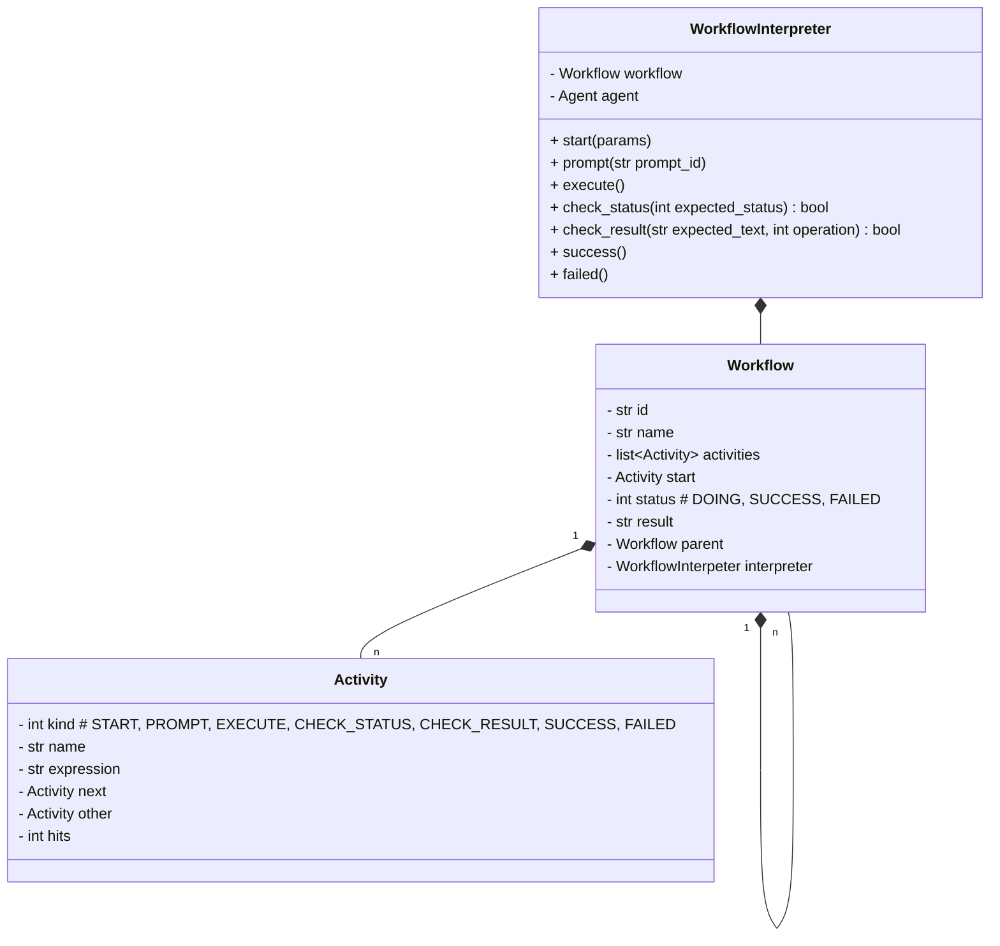
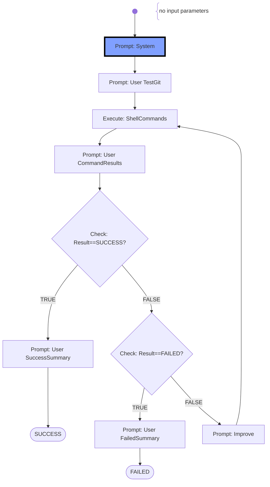

# Workflow

- A **Workflow** is started by an objective given from the user, e.g. grade a student submission
- The **Workflow** consists of multiple activities which will be run like a flow-diagram (divide and concquer)
- Possible tasks are: start, create agent (returns an agent), prompt agent (returns the agent's output), execute commands, checkpoint, finish
- A **Workflow** may use sub-**Workflow**s
- Within a workflow AI-agents use the tool-chain (**CommandExecutors**), colloberate to each other, and with the user (if required)
- The **WorkflowInterpreter** provides the shared context between all AI-agents, the tool-chain, and the user for collaboration
- The **WorkflowInterpreter** controls the execution of the collaboration, executes the parties (AI-Agents, Commands), checks the overall status of tasks and the workflow, and interrupts/fails the workflow on problems
- The **WorkflowInterpreter** will limit the collaboration due to, cost limits of AI-APIs, char/token limits, time limits, and iteration limits

## Class Diagrams

## Workflow Charts

### Workflow 1: "Check toolchain"
This (sub-) workflow is used for (unit)-testing.

