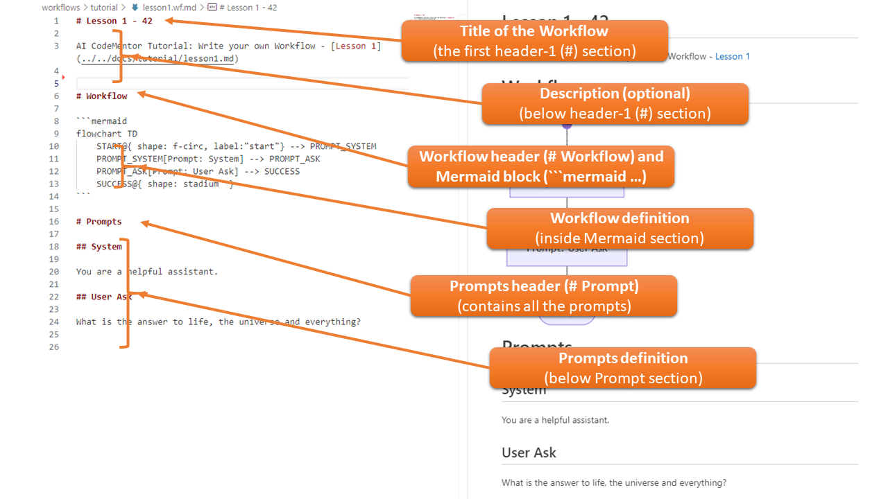
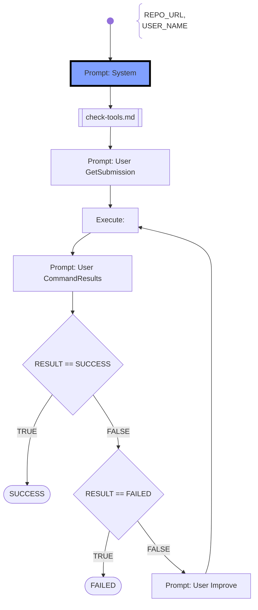
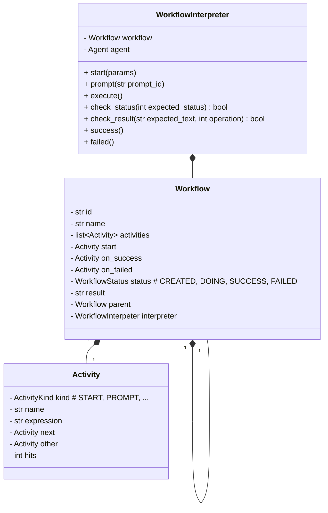

# Workflow

- A **Workflow** is started by an objective given from the user, e.g. grade a student submission
- The **Workflow** consists of multiple activities which will be run like a flow-diagram (divide and concquer)
- Possible tasks are: start, create agent (returns an agent), prompt agent (returns the agent's output), execute commands, checkpoint, finish
- A **Workflow** may use sub-**Workflow**s
- Within a workflow AI-agents use the tool-chain (**CommandExecutors**), colloberate to each other, and with the user (if required)
- The **WorkflowInterpreter** provides the shared context between all AI-agents, the tool-chain, and the user for collaboration
- The **WorkflowInterpreter** controls the execution of the collaboration, executes the parties (AI-Agents, Commands), checks the overall status of tasks and the workflow, and interrupts/fails the workflow on problems
- The **WorkflowInterpreter** will limit the collaboration due to, cost limits of AI-APIs, char/token limits, time limits, and iteration limits

## Workflow File-Format

The Workflow definition is stored in Markfown (.md) files, so they can easily be edited with common Markdown editors. The Markdown file **must** have a specific structure in the content, so that it can be loaded, here is an example: 



The file consists of the following sections:

- **Title**: Any title defined at the first header-1 (`#`) section.  
  **Example:** `# Lesson 1 - 42`
- **Description**: Any Markdown content that describes the workflow. This section is optional and will not be used by CodeMentor.  
  **Example:** `AI CodeMentor Tutorial: ...`
- **Workflow**: The header-1 section named `# Workflow` marks where activities are defined in a flowchart diagram.
- **Workflow Definition**: Defined using the Mermaid Flowchart Diagram syntax.  
- **Prompts**: The header-1 section `# Prompts` defines the prompts used in the workflow. Separating prompts from the flowchart allows for better readability and reusability.
- **Prompt Definitions**: This section contains multiple prompt definitions. In this example:
  1. **System Prompt** (`## System`) – Used to create a new AI-Agent and set the system context.
  2. **User Prompt** (`## User Ask`) – Must start with `## User ` followed by a title.
  3. **Assistant Prompt** (`## Assistant Example`) - Optional (not in the picture): To provide assistant result messages.

    You may have multiple **User**, **Assistant** and **System** sub-sections.


## Workflow Interpretion

- A workflow consists of a list of **Activities**
- Every Activity is of a special **ActivityKind** which describes the actions to take place
- Every workflow has a **START** Activity, which must be included in the flow-chart
- Every workflow has a **SUCCESS** Activity, which does not need to be shown in the flow-chart. When the current activity has no next-activity defined, then automatically the **SUCCESS** Activity is reaced next.
- Every workflow has a **FAILED** Activity, which does not need to be shown in the flow-chart. When there is an error during activity running or the failed-activity in the **CHECK** activity is to be taken but not connected, then the **FAILED** Activiy is automatically reached next.
- Running the **SUCCESS** or **FAILED** activities will end the Workflow interpretation which the corresponding SUCCESS- oder FAILURE- Status Code.
- A workflow is using **Variables** which provides a "data context" to the activities. The activities may read and write the values to that variables. (see Variables section below)


## Activities Reference

* **START**: The starting point of every workflow. Defined as `START` in Mermaid syntax.
    ```mermaid
    flowchart TD
        START@{ shape: f-circ, label:"start"}
    ```

* **SET**: Sets a variable to a prompt (from the # Prompts-section ), a variable or a constant.
    ```mermaid
    flowchart TD
        SET_TESTING_RESULT[TESTING_RESULT=RESULT]
    ```

* **ASSIGN**: Assigns a prompt (from the # Prompts-section ), a variable or a constant to the *RESULT*
    ```mermaid
    flowchart TD
        ASSIGN_RESULT[Assign: User Task-Desc]
    ```   
* **CHECK**: Evaluates an expression, if it is true or false. If true, then the normal flow (or named with "YES", "TRUE", "SUCCESS") will be followed. Otherwise the flow will continue on the path named "NO", "FALSE", "OTHER", or "ERROR".
    ```mermaid
    flowchart TD
        CHECK_RESULT_SUCCESS{RESULT == 'SUCCESS'}

        CHECK_RESULT_SUCCESS --> |TRUE| SUCCESS@{ shape: stadium  }
        CHECK_RESULT_SUCCESS --> |FALSE| FAILED@{ shape: stadium  }

        style SUCCESS stroke:#A0A0A0,stroke-width:1px,fill:#ffffff
        style FAILED stroke:#A0A0A0,stroke-width:1px,fill:#ffffff
    ```
    The following operations exist:
    - **Equals**: ` == ` or ` eq `
    - **Differs** (not equal): ` != ` or ` ne `
    - **Contains**: ` CONTAINS `
    - **Matches**: ` MATCHES `
        To evaluate a regular expression.
    - **Greater Than**: ` gt `
    - **Greater Equal**: ` ge `
    - **Less Than**: ` lt `
    - **Less Equal**: ` le `
    
    ATTENTION: Don't forget the space-char before and after the operation. (Otherwise the expression can't be parsed correctly).

* **PROMPT**: Sends a system-, user- or assistant-prompt to the AI-Agent. Must start with `PROMPT_` and have a caption beginning with `Prompt:`. The AI-Agent will execute the prompt and return the answer into the *RESULT* variable.
    ```mermaid
    flowchart TD
        PROMPT_ASK[Prompt: User Task-Desc]
    ```

* **EXECUTE**: Activities beginning with **"EXECUTE_"** execute commands. This activity extracts commands from the previous *RESULT* by scanning the `` ``` `` code blocks in the Markdown text. These commands are then parsed, classified (e.g., as BASH shell commands), and executed within the AI CodeMentor runtime environment, which is provided via a Docker container.    
   **Important:** The caption must start with `"Execute: "`. 
    ```mermaid
    flowchart TD
        EXECUTE_OUTPUT[Execute: ]
    ```
   
   If you want to use predefined commands instead of extracting them from *RESULT*, append them directly after `"Execute: "`.
    ```mermaid
    flowchart TD
        EXECUTE_OUTPUT[Execute: cd ~]
    ```   
* **CALL**: Calls a sub-workflow, which is provided by the filename.
    ```mermaid
    flowchart TD
        CALL_TESTING[[paperless-sprint1-testing.wf.md]]
    ```

* **SUCCESS**: The endpoint of every workflow, which succeeded.
    ```mermaid
    flowchart TD
        SUCCESS@{ shape: stadium  }
    ```

* **FAILED**: The endpoint of every workflow, which failed or when an (unhandled) error occured.
    ```mermaid
    flowchart TD
        FAILED@{ shape: stadium  }
    ```

* **ON_???**: Define an event-handler which is automatically executed then the corresponding activity is reached:
    - **ON_SUCCESS** - when **SUCCESS** is reached or the workflow finished successfully.
        ```mermaid
        flowchart TD
            ON_SUCCES@{ shape: stadium } --> PROMPT_SUCCESS_REPORT
            style PROMPT_SUCCESS_REPORT stroke:#A0A0A0,stroke-width:1px,fill:#ffffff
        ```

    - **ON_FAILED** -  when **FAILED** is reached or the workflow was terminated due to an error.
        ```mermaid
        flowchart TD
            ON_FAILED@{ shape: stadium } --> PROMPT_FAILED_REPORT
            style PROMPT_FAILED_REPORT stroke:#A0A0A0,stroke-width:1px,fill:#ffffff
        ```

### Sample Workflow: "Check toolchain"
This (sub-) workflow is used for (unit)-testing.



## Variables

### Internal (hard-coded) variables

- When a variable is used, on first hand it is searched for in this section.
- **STATUS**: represents the current state of the workflow as enum with the following possible values: CREATED, DOING, SUCCES, FAILED
- **RESULT** (or **CONTENT**): represents a "big" string value, which is usually Markdown formated. The string can be processed also line based. Most activities will update this value.

### Workflow Parameters

- If the variable name was not found in the Internal Variables, the current section is searched.
- On the creation/loading of a workflow a dictionary of key/value pairs are passed. The keys represent the variable names (use upper-case only) and the values the corresponding (string) value.

### Environmental variables

- When the variable name is also not found in the Internal Variables, then the environment variables are searched.
- The system will try to fetch the variable from the Operating-System environmental variables.
- This way it is easily possible to inject data from outside and use it in the workflow.

# AI CodeMentor - Workflow Architecture

## Class Diagram



