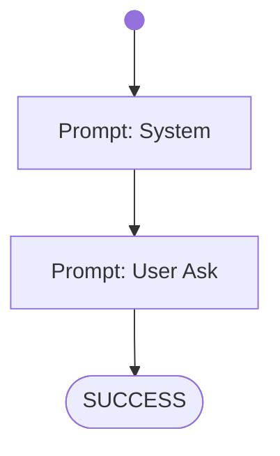

# Lesson 1 - 42

AI CodeMentor Tutorial: Write your own Workflow - [Lesson 1](../../docs/tutorial/lesson1.md)

# Workflow

# Prompts

## System

You are a helpful assistant.

## User Ask

What is the answer to life, the universe and everything?

