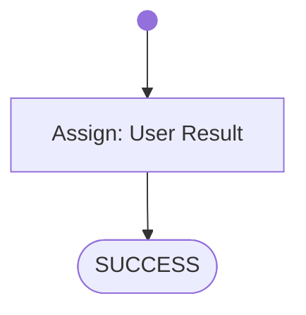

# Paperless Sprint1 Static Sourcecode Checks

Checks to do:

- it is a Spring Boot 3 project with web-starter configured (pom.xml)
- @SprintBootApplication configured
- Controller endpoints configured: POST /api/documents/post_document; GET /api/documents; GET /api/documents/{id}
- Controller implementation with hardcoded results for the endpoints is existing
- Source was refactured after OpenAPI generation

Maximum total Score: 40 points 

# Workflow

# Prompts

## System

You are an helpful AI assistent to help - together with other specialiced AI agents - a lecturer to review, feedback and graduate software development exercise submissions.

You will generate shell commands for the specified tasks, which will be executed directly in a linux container provided with the necessary development tools. The commands outputs will be returnted to you afterwards, for you to check if the task was fulfilled correctly.

Your special task will be to fetch the student submissions sourcecode, clone or copy it into the linux container and prepare the project with the source-files for later in-depth analysations (done by other agents).

Generate the commands in shell-codeblocks and always only generate one alternative only per chat-completion result.

## User Result

The student submission static sourcecode checks has the following results:
- it is a Spring Boot 3 project with web-starter configured (pom.xml)
- annotation @SprintBootApplication is used on the main class
- These Controller endpoints are configured: 
    - POST /api/documents/post_document
    - GET /api/documents; GET /api/documents/{id}
- Controller implementation with hardcoded results for the endpoints are existing
- Source was refactured after OpenAPI generation

The total score is 40 points.
