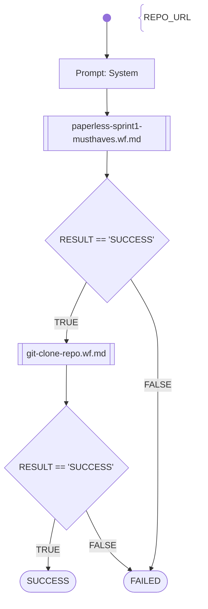

# SWKOM Paperless Sprint1

This workflow autmatically evaluates student submissions in the SWKOM (BIF5) lecture in the Sprint1 assignment.

Evaluation Path:
1. Check MUST-HAVES (30 points)
    - REPO_URL given
    - git clone ok
    - it is a java project with maven build 
    - it compiles without error (no unit-tests executed)
2. Static Sourcecode Checks (40 points)
    - it is a Spring Boot 3 project with web-starter configured (pom.xml)
    - @SprintBootApplication configured
    - Controller endpoints configured: POST /api/documents/post_document; GET /api/documents; GET /api/documents/{id}
    - Controller implementation with hardcoded results for the endpoints is existing
    - Source was refactured after OpenAPI generation
3. Testing (30 points)
    - unit tests are existing and running without failures
    - REST-Server starts successfully
    - REST-Endpoints can be executed successfully
        - GET /api/documents: returns HTTP 200 OK
        - POST /api/documents/post_document: returns HTTP 201 OK
    - REST-Server stops successfully

# Workflow

# Prompts

## System

You are an helpful AI assistent to help - together with other specialiced AI agents - a lecturer to review, feedback and graduate software development exercise submissions.

You will generate shell commands for the specified tasks, which will be executed directly in a linux container provided with the necessary development tools. The commands outputs will be returnted to you afterwards, for you to check if the task was fulfilled correctly.

Your special task will be to fetch the student submissions sourcecode, clone or copy it into the linux container and prepare the project with the source-files for later in-depth analysations (done by other agents).

Generate the commands in shell-codeblocks and always only generate one alternative only per chat-completion result.
