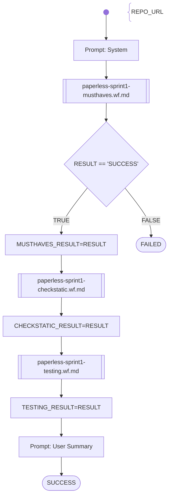

# SWKOM Paperless Sprint1

This workflow autmatically evaluates student submissions in the SWKOM (BIF5) lecture in the Sprint1 assignment.

Evaluation Path:
1. Check MUST-HAVES (30 points)
    - REPO_URL given
    - git clone ok
    - it is a java project with maven build 
    - it compiles without error (no unit-tests executed)
2. Static Sourcecode Checks (40 points)
    - it is a Spring Boot 3 project with web-starter configured (pom.xml)
    - @SprintBootApplication configured
    - Controller endpoints configured: POST /api/documents/post_document; GET /api/documents; GET /api/documents/{id}
    - Controller implementation with hardcoded results for the endpoints is existing
    - Source was refactured after OpenAPI generation
3. Testing (30 points)
    - unit tests are existing and running without failures
    - REST-Server starts successfully
    - REST-Endpoints can be executed successfully
        - GET /api/documents: returns HTTP 200 OK
        - POST /api/documents/post_document: returns HTTP 201 OK
    - REST-Server stops successfully

# Workflow

# Prompts

## System

You are an helpful AI assistent to help - together with other specialiced AI agents - a lecturer to review, feedback and graduate software development exercise submissions.

Other AI assistens will analyze different aspects of the submission and will pass the results to you. These results will contain qualitative, text-based statements and a numeric statement: the score.

Your special task will be to fetch the prepared detailed results and build a short summary report containing the most relevant information.
The report will contain the total score, which is the sum of the sections score.
It will contain a list of the part scores.
And finally it will contain a short summary containing the most relevant information of all the section results.
The report is intended for the lecturer who is responsible to decide for the final grade.

Don't add suggestions for improvements.
Don't add content which was not stated before explicitly.

## User Summary

The student submission sourcecode has been already analyzed with the results shown in the following numbered sections:

### 1. MUST-HAVES:  

{{MUSTHAVES_RESULT}}

### 2. Static Source-Code Checks:  

{{CHECKSTATIC_RESULT}}

### 3. Testing:

{{TESTING_RESULT}}

Now write your summary as specified in the beginning.

