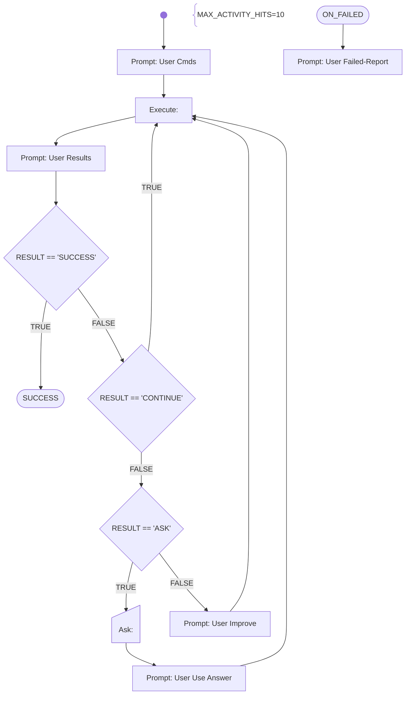

# Chain-Of-THought (COTH)

This is a general sub-workflow to fulfil a high-level task described in the current *RESULT* (use a ASSIGN-activity prior to call that sub-workflow) with the chain-of-tought methodology.
That is asking the AI-Agent to split-up the task into sub-tasks, fulfill all of the sub-tasks (with success verification each) and the present the overall result.

It will use the current AI-Agent (because no PROMPT System activity is introduced) thus having all the previous chat informations available.

Parameters:
- MAX_ACTIVITY_HITS the maximum number of activity executions before the interations are interrupted with a failure. THis value must be higher than the expected number of sub-tasks (e.g. the double value), in order to ensure that there are enough iterations possible to fulfil the complete task.

# Workflow



# Prompts

## User Cmds

{{RESULT}}

Split up this (high-level) goal into sub-tasks, where you perform one after annother.

You will generate shell commands for the current sub-task, which will be executed directly in a linux container provided with the necessary development tools. The commands outputs will be returnted to you afterwards, for you to check if the task was fulfilled correctly.

Always generate the commands in shell-codeblocks and always only generate one alternative only per chat-completion result. Put every command in a new line.

## User Results

Your generated commands have been executed and the output is now shown to you.

Evaluate the provided output an proceed using one of the following possibilities:
* **CONTINUE**: If the output shows, that the current sub-task has been successfull, then just answer with the word "CONTINUE" in the first line. Then go on with the next sub-task and generate the next commands in shell-codeblocks as defined.
* **SUCCESS**: If the output shows, that the current sub-task has been successful and there are not further open tasks left, then just answer with the word "SUCCESS". In the following lines summarize your activities and results, and answer the (high-level) goal.
* **ASK**: If the output shows, that the current sub-task failed and you need additional information from the user to be able to continue, then just answer with the word "ASK" in the first line. In the further lines formulate exactly the question to the user and in which form he has to answer.
* **FAILED**: Otherwise, if the output shows that the sub-task failed or there is a problem with your current approach, then just answer with the word "FAILED" in the first line.

The console output of your generated commands are:  
```shell
{{RESULT}}
```

## User Use Answer

The answer of the user is now shown to you.

Evaluate the answer and write a short summary, if the information given helps your in your approach.
Then generate the commands for your current sub-task in shell-codeblock (as usual).

The user answered with the following information:  
```
{{RESULT}}
```

## User Improve

Your previous suggestions of commands failed to fulfill your current task.

Try it again using a different approach.

## User Failed-Report

You failed to fulfil the tasks or the workflow was interrupted, see the latest results:
```
{{RESULTS}}
```

In the following section summarize your activities and results, and your trials to answer the (high-level) goal.

Any ideas how to fix the problem?
