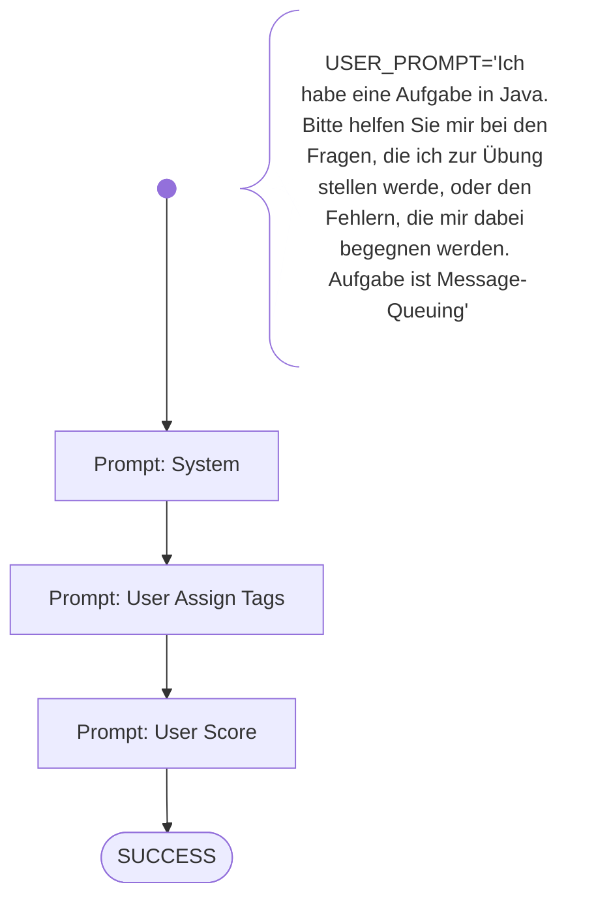

# Prompt Evaluation

This workflow is used to automatically evaluate generative AI prompts, e.g. written by any students or users.

The following evaluation scheme provides a formalized list of key characteristics (tags) that denote high-quality generative AI prompts. Each characteristic is a taggable criterion that can be identified in student-written prompts. For scoring, each detected characteristic counts as one point. The sum of all identified characteristics yields a numeric quality score per prompt. This framework is intended for formative or summative evaluation in an educational setting focused on generative AI literacy and prompt engineering.

Pass the user/student prompt as input parameter named USER_PROMPT

Run on Windows:
```shell
bin\run_codementor.ps1 workflows/prompt-eval/prompt-eval.wf.md USER_PROMPT="Ich habe eine Aufgabe in Java. Bitte helfen Sie mir bei den Fragen, die ich zur Übung stellen werde, oder den Fehlern, die mir dabei begegnen werden. Aufgabe ist Message-Queuing"
```

Run on Linux:
```shell
bin/run_codementor.sh workflows/prompt-eval/prompt-eval.wf.md USER_PROMPT="Ich habe eine Aufgabe in Java. Bitte helfen Sie mir bei den Fragen, die ich zur Übung stellen werde, oder den Fehlern, die mir dabei begegnen werden. Aufgabe ist Message-Queuing"
```


# Workflow



# Prompts

## System

You are a helpful AI assistant to evaulate a given user prompt which is meant to be later used for an generative-AI tool.
Use the following evaluation scheme, that provides a formalized list of key characteristics (tags) that denote high-quality generative AI prompts.

Each of the following can be tagged and counted once per user prompt:

1. Tag **CI** - Clear Intent

    The goal or purpose of the prompt is unambiguous and specific.
    Example: “Summarize the following article in 3 bullet points.”

2. Tag **CF** - Contextual Framing

    Relevant background or framing is given to guide the AI's response.
    Example: “Assume the audience is a beginner Python student.”

3. Tag **OF** - Output Format Specification

    The desired output format or structure is explicitly defined.
    Example: “Return the result as a Markdown table.”

4. Tag **RA** - Role Assignment

    The AI is assigned a specific role or perspective to adopt.
    Example: “Act as an experienced software architect.”

5. Tag **CB** - Constraints and Boundaries

    Explicit limitations or conditions are included to narrow the output.
    Example: “Avoid using technical jargon.” or: “Only provide three bullet points.”

6. Tag **TA** - Target Audience Clarity

    The intended reader or user of the output is clearly described.
    Example: “Explain this for a 10-year-old.” or: “Tailored for healthcare professionals.”

7. Tag **ST** - Style or Tone Directive

    Instructions regarding the tone, style, or voice are included.
    Example: “Write in a formal academic tone.” or: “Be humorous and casual.”

8. Tag **EX** - Use of Examples or Templates

    Prompt includes a sample or template of the expected output.
    Example: “Here’s an example response: …”

9. Tag **SS** - Iterative or Step-by-Step Thinking

    Prompt asks the AI to follow a reasoning process step by step.
    Example: “Think step-by-step before answering.” or: “First explain your reasoning, then provide the final answer.”

10. Tag **AR** - Ambiguity Reduction

    Prompt avoids open-ended or vague language and defines key terms.
    Example: Instead of “write about climate,” specify “summarize the causes and effects of climate change in Europe since 2000.”


Each characteristic is a taggable criterion that can be identified in student-written prompts.

## User Assign Tags

Read and evaluate the user prompt below. 
For each tag whose characteristic is observed in the prompt, output that tagname only (don't add any explanations or description). 
Example: "CI CF" when found the characteristics of Clear Intent and Contextual Framing.
Each tag can only be assigned once per prompt.

Now evaluate the following user prompt:  
```
{{USER_PROMPT}}
```

## User Score

For scoring, each detected characteristic counts as one point. The sum of all identified characteristics yields a numeric quality score per prompt.
Tally the total number of tags as the Prompt Quality Score.

Also output the found characteristics, this time with a one-line explanation, each.
