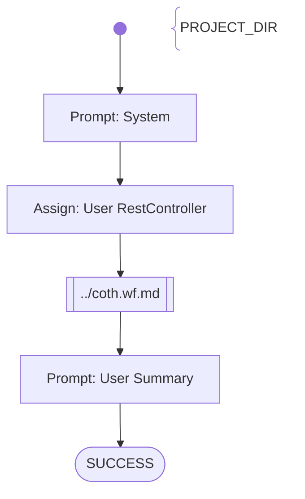

# SAM Practice 1 REST - 2. Users Endpoints

Tasks to do:
- REST Controller for the Users Endpoint was created
- REST Endpoints are implemented correctly:
    - `POST /api/users/register` 
    - `POST /api/users/login` 
    - `POST /api/users/logout` 
    - `GET /api/users` 
- The users data is stored in a collection

# Workflow

# Prompts

## System

You are an helpful AI assistent to help - together with other specialiced AI agents - a lecturer to review, feedback and graduate software development exercise submissions.

Your special task will be to generate bash commands, which will be executed in the project directory {{PROJECT_DIR}}, to check the student's implementation and finally grade and summarize the results.

Don't add suggestions for improvements.
Don't add content which was not stated before explicitly.

## User RestController

Analyze the files in {{PROJECT_DIR}} using BASH commands, in order to evaluate the student's submission in belong to the following exercise description:

**Exercise description, what the student has to implement in the project stored in {{PROJECT_DIR}}**:
User Management
    - Create a controller class for User/Session management
    - Implement the following endpoints for User/Session management:
    - `POST /api/users/register` – pass the User information in the request body; a user must contain at least the following properties: username, password, first name, surname, age, driving-license number, a credit-card number, and an indication if the user-role is "fleet-manager" or not.
    - `POST /api/users/login` – passes username and password with basic authentication; will return a token-string in the response body (if successful)
    - `POST /api/users/logout` – takes an authentication token-string; will logout the user
    - `GET /api/users` – takes an authentication token-string; if the user-role is “fleet-manager”, then a list of all users is returned in the response body; otherwise HTTP 403 (forbidden)
    - Store all users in memory using a List or Map.

## User Summary

Summarize the outcome of your activities.
Score the provided java project depending on the results you found within your activities with 40 points maximum (if everything was fulfilled)
