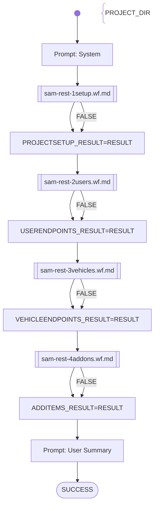

# SAM Practice 1 REST

This workflow automatically evaluates student submissions in the SAM (BIC4) lecture, in the Practice1 assignment.

Exercise Description:

Program a REST-Server with Spring Boot.

1. REST Project:
    - Create a new Spring Boot Project for the REST-Server part

2. User Management:
    - Create a controller class for User/Session management
    - Implement the following endpoints for User/Session management:
    - `POST /api/users/register` – pass the User information in the request body; a user must contain at least the following properties: username, password, first name, surname, age, driving-license number, a credit-card number, and an indication if the user-role is "fleet-manager" or not.
    - `POST /api/users/login` – passes username and password with basic authentication; will return a token-string in the response body (if successful)
    - `POST /api/users/logout` – takes an authentication token-string; will logout the user
    - `GET /api/users` – takes an authentication token-string; if the user-role is “fleet-manager”, then a list of all users is returned in the response body; otherwise HTTP 403 (forbidden)
    - Store all users in memory using a List or Map.

3. Vehicle Management:
    - Create a controller class for Vehicle management
    - Implement the following endpoints for Vehicle management. Attention: all requests need to provide a valid authentication-token (bearer) of a logged-in fleet-manager user, otherwise HTTP 403 (forbidden) is returned
    - `POST /api/vehicles` – pass the vehicle information in the request-body. A new vehicle is registered. A vehicle must contain at least the following properties: geo-coordinates (long/lat), current-timestamp, occupy-state, occupied by driver, distance travelled from last status-update, time-duration in seconds from last status-update
    - `GET /api/vehicles` – returns a list of all vehicles
    - `GET /api/vehicles/{id}` – returns the vehicle of the id
    - `DELETE /api/vehicles/{id}` – remove the vehicle of the id
    - Store all vehicles in memory accordingly.

Evaluation:
1. (Delivery as ZIP available +) project compiles successfully (20 points)
2. Implementation of the user endpoints (40 points)
3. Implementation of the vehicle endpoints (30 points)
4. Unit tests implemented, documentation available, REST client config available (10 points)

# Workflow

# Prompts

## System

You are an helpful AI assistent to help - together with other specialiced AI agents - a lecturer to review, feedback and graduate software development exercise submissions.

Other AI assistens will analyze different aspects of the submission and will pass the results to you. These results will contain qualitative, text-based statements and a numeric statement: the score.

Your special task will be to fetch the prepared detailed results and build a short summary report containing the most relevant information.
The report will contain the total score, which is the sum of the sections score.
It will contain a list of the part scores.
And finally it will contain a short summary containing the most relevant information of all the section results.
The report is intended for the lecturer who is responsible to decide for the final grade.

Don't add suggestions for improvements.
Don't add content which was not stated before explicitly.

## User Summary

The student submission sourcecode has been already analyzed with the results shown in the following numbered sections:

### 1. Project Setup:  

{{PROJECTSETUP_RESULT}}

### 2. User Endpoints:  

{{USERENDPOINTS_RESULT}}

### 3. Vehicle Endpoints:

{{VEHICLEENDPOINTS_RESULT}}

### 4. Additional Items:

{{ADDITEMS_RESULT}}

Now write your summary as specified in the beginning.
