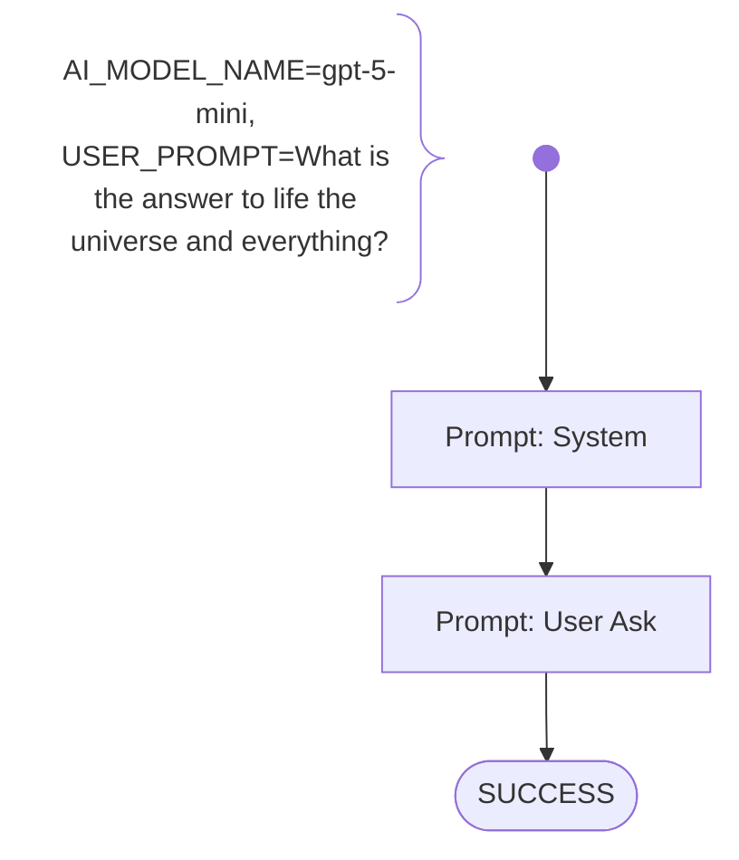

# Test Parameters

This workflow is used to check workflow parameters.

# Workflow

```mermaid
flowchart TD
    PARAMS@{ shape: brace-r, label: "AI_MODEL_NAME=gpt-5-mini, USER_PROMPT=What is the answer to life the universe and everything?" }
    START@{ shape: f-circ, label:"start"} --> PROMPT_SYSTEM
    PROMPT_SYSTEM[Prompt: System] --> PROMPT_ASK
    PROMPT_ASK[Prompt: User Ask] --> SUCCESS
    SUCCESS@{ shape: stadium  }
```

# Prompts

## System

You are a helpful assistant.

## User Ask

{{USER_PROMPT}}

