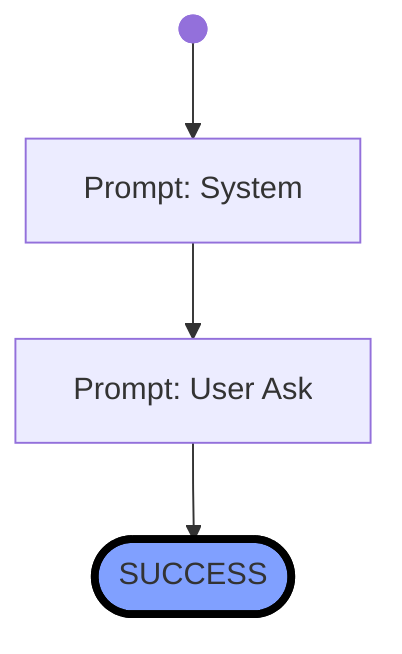

# Lesson 1 - 42

- filepath=workflows/tutorial/lesson1.wf.md

# Workflow

## Variables:  

# History

## 1. Start  => DOING
<!-- ts=2025-01-31 14:02:15.905138 -->

## 2. Prompt: System  => DOING
<!-- ts=2025-01-31 14:02:15.952239 -->
You are a helpful assistant.

---

## 3. Prompt: User Ask  => DOING
<!-- ts=2025-01-31 14:02:20.515704 -->
What is the answer to life, the universe and everything?

---

The answer to life, the universe, and everything is famously stated as "42" in Douglas Adams' science fiction series "The Hitchhiker's Guide to the Galaxy." This humorous response has become a popular cultural reference, symbolizing the search for meaning in life.

## 4. SUCCESS  => SUCCESS
<!-- ts=2025-01-31 14:02:20.527943 -->
The answer to life, the universe, and everything is famously stated as "42" in Douglas Adams' science fiction series "The Hitchhiker's Guide to the Galaxy." This humorous response has become a popular cultural reference, symbolizing the search for meaning in life.

