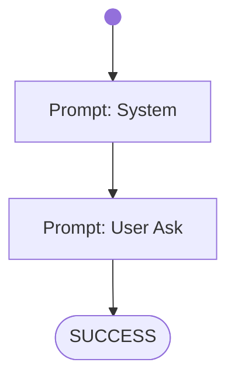

# Lesson 1 - 42

AI CodeMentor Tutorial: Write your own Workflow - [Lesson 1](../../docs/tutorial/lesson1.md)

Try it out! From the project directory run:

on Windows:
```shell
bin\build_codementor.ps1
bin\run_codementor.ps1 workflows/tutorial/lesson1.wf.md
```
on Linux:
```shell
bin\build_codementor.ps1
bin\run_codementor.ps1 workflows/tutorial/lesson1.wf.md
```


# Workflow



# Prompts

## System

You are a helpful assistant.

## User Ask

What is the answer to life, the universe and everything?

