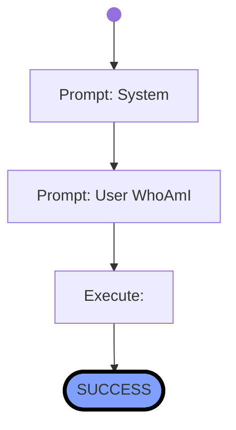

# Lesson 2 - Who Am I

- filepath=workflows/tutorial/lesson2.wf.md

# Workflow


## Variables:  


# History

## 1. Start  => DOING
<!-- ts=2025-01-31 14:02:54.364493 -->

## 2. Prompt: System  => DOING
<!-- ts=2025-01-31 14:02:54.414378 -->
You are a helpful assistant.

You will generate shell commands for the specified tasks, which will be executed directly in a linux container provided with the necessary command-line tools.

Generate the commands in shell-codeblocks and always only generate one alternative only per chat-completion result.

---


## 3. Prompt: User WhoAmI  => DOING
<!-- ts=2025-01-31 14:02:55.894214 -->
Show the name of the current user.
Afterwards check which linux and bash versions are running.
Finally also show me the installed python version.

---

```bash
whoami && lsb_release -a && bash --version && python --version
```


## 4. Execute:   => DOING
<!-- ts=2025-01-31 14:02:55.944706 -->
Input:
```shell
whoami && lsb_release -a && bash --version && python --version
```

Output:
```shell
mentor
Distributor ID:	Debian
Description:	Debian GNU/Linux 12 (bookworm)
Release:	12
Codename:	bookworm
GNU bash, version 5.2.15(1)-release (x86_64-pc-linux-gnu)
Copyright (C) 2022 Free Software Foundation, Inc.
License GPLv3+: GNU GPL version 3 or later <http://gnu.org/licenses/gpl.html>

This is free software; you are free to change and redistribute it.
There is NO WARRANTY, to the extent permitted by law.
Python 3.12.8
```


## 5. SUCCESS  => SUCCESS
<!-- ts=2025-01-31 14:02:55.953228 -->
$ whoami && lsb_release -a && bash --version && python --version
mentor
Distributor ID:	Debian
Description:	Debian GNU/Linux 12 (bookworm)
Release:	12
Codename:	bookworm
GNU bash, version 5.2.15(1)-release (x86_64-pc-linux-gnu)
Copyright (C) 2022 Free Software Foundation, Inc.
License GPLv3+: GNU GPL version 3 or later <http://gnu.org/licenses/gpl.html>

This is free software; you are free to change and redistribute it.
There is NO WARRANTY, to the extent permitted by law.
Python 3.12.8


