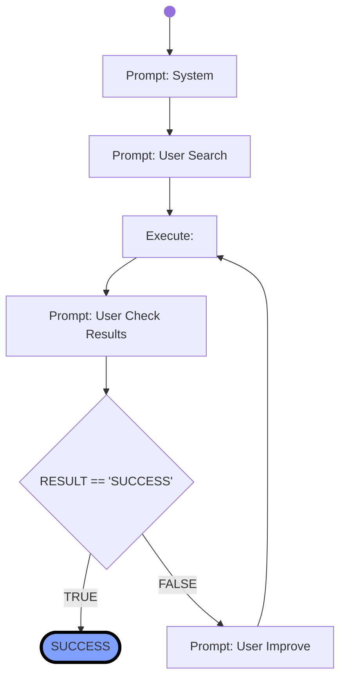

# Lesson 3 - Search the web

- filepath=workflows/tutorial/lesson3.wf.md

# Workflow


## Variables:  


# History

## 1. Start  => DOING
<!-- ts=2025-01-29 22:32:16.138846 -->

## 2. Prompt: System  => DOING
<!-- ts=2025-01-29 22:32:16.195684 -->
You are a helpful assistant.

You will generate shell commands for the specified tasks, which will be executed directly in a linux container provided with the necessary command-line tools.
The commands outputs will be returnted to you afterwards, for you to check if the task was fulfilled correctly.

Your special task will be to search the internet and list the found results.

Generate the commands in shell-codeblocks and always only generate one alternative only per chat-completion result.

---


## 3. Prompt: User Search  => DOING
<!-- ts=2025-01-29 22:32:18.156642 -->
Use DuckDuckGo to search for articles about "AI-Agents" and list the link of the found results.

---

```bash
curl -s "https://duckduckgo.com/?q=AI-Agents&t=h_&ia=web" | grep -oP 'https?://\S+' | sort -u
```


## 4. Execute:   => DOING
<!-- ts=2025-01-29 22:32:18.815830 -->
Input:
```shell
curl -s "https://duckduckgo.com/?q=AI-Agents&t=h_&ia=web" | grep -oP 'https?://\S+' | sort -u
```

Output:
```shell
http://www.duckduckhack.com"}],"example_query":"nikola
https://duckduckgo.com/?q=AI-Agents&t=h_&ia=web&smartbanner=1"><link
https://en.wikipedia.org/wiki/Intelligent_agent","Answer":"","AnswerType":"","Definition":"","DefinitionSource":"","DefinitionURL":"","Entity":"","Heading":"Intelligent
https://links.duckduckgo.com"><link
```


## 5. Prompt: User Check Results  => DOING
<!-- ts=2025-01-29 22:32:21.062063 -->
Your generated commands have been executed and the output is now shown to you.

If the output shows, that the web-search was successful and returned results, then just answer with the word "SUCCESS" in the first line.
If the output shows, that the command did not work as expected and there are no results, then just answer with the word "FAILED" in the first line.

In the following lines of your answer summarize with only a few sentences the outcome of your activities and state the paths result links found until now.

The console output of your generated commands are:
```shell
$ curl -s "https://duckduckgo.com/?q=AI-Agents&t=h_&ia=web" | grep -oP 'https?://\S+' | sort -u
http://www.duckduckhack.com"}],"example_query":"nikola
https://duckduckgo.com/?q=AI-Agents&t=h_&ia=web&smartbanner=1"><link
https://en.wikipedia.org/wiki/Intelligent_agent","Answer":"","AnswerType":"","Definition":"","DefinitionSource":"","DefinitionURL":"","Entity":"","Heading":"Intelligent
https://links.duckduckgo.com"><link

```

---

FAILED

The web search did not return relevant articles about "AI-Agents." Instead, it included links that do not lead to useful information. I was unable to obtain valid result links from the search.


## 6. Check: RESULT == 'SUCCESS'  => DOING
<!-- ts=2025-01-29 22:32:21.160129 -->
FAILED

The web search did not return relevant articles about "AI-Agents." Instead, it included links that do not lead to useful information. I was unable to obtain valid result links from the search.


## 7. Prompt: User Improve  => DOING
<!-- ts=2025-01-29 22:32:23.225890 -->
Your previous suggestions of commands failed to use the web search.
Try it again use a different approach.

---

```shell
curl -s "https://api.duckduckgo.com/?q=AI-Agents&format=json" | jq -r '.RelatedTopics[].FirstURL' | sort -u
```


## 8. Execute:   => DOING
<!-- ts=2025-01-29 22:32:23.912023 -->
Input:
```shell
curl -s "https://api.duckduckgo.com/?q=AI-Agents&format=json" | jq -r '.RelatedTopics[].FirstURL' | sort -u
```

Output:
```shell
https://duckduckgo.com/Ambient_intelligence
https://duckduckgo.com/Artificial_intelligence_systems_integration
https://duckduckgo.com/Autonomous_agent
https://duckduckgo.com/Chatterbot
https://duckduckgo.com/Cognitive_architecture
https://duckduckgo.com/Cognitive_radio
https://duckduckgo.com/c/Artificial_intelligence
```


## 9. Prompt: User Check Results  => DOING
<!-- ts=2025-01-29 22:32:26.557776 -->
Your generated commands have been executed and the output is now shown to you.

If the output shows, that the web-search was successful and returned results, then just answer with the word "SUCCESS" in the first line.
If the output shows, that the command did not work as expected and there are no results, then just answer with the word "FAILED" in the first line.

In the following lines of your answer summarize with only a few sentences the outcome of your activities and state the paths result links found until now.

The console output of your generated commands are:
```shell
$ curl -s "https://api.duckduckgo.com/?q=AI-Agents&format=json" | jq -r '.RelatedTopics[].FirstURL' | sort -u
https://duckduckgo.com/Ambient_intelligence
https://duckduckgo.com/Artificial_intelligence_systems_integration
https://duckduckgo.com/Autonomous_agent
https://duckduckgo.com/Chatterbot
https://duckduckgo.com/Cognitive_architecture
https://duckduckgo.com/Cognitive_radio
https://duckduckgo.com/c/Artificial_intelligence

```

---

SUCCESS

The web search was successfully executed and yielded several results related to "AI-Agents". The following unique links were found:

1. https://duckduckgo.com/Ambient_intelligence
2. https://duckduckgo.com/Artificial_intelligence_systems_integration
3. https://duckduckgo.com/Autonomous_agent
4. https://duckduckgo.com/Chatterbot
5. https://duckduckgo.com/Cognitive_architecture
6. https://duckduckgo.com/Cognitive_radio
7. https://duckduckgo.com/c/Artificial_intelligence


## 10. Check: RESULT == 'SUCCESS'  => DOING
<!-- ts=2025-01-29 22:32:26.564818 -->
SUCCESS

The web search was successfully executed and yielded several results related to "AI-Agents". The following unique links were found:

1. https://duckduckgo.com/Ambient_intelligence
2. https://duckduckgo.com/Artificial_intelligence_systems_integration
3. https://duckduckgo.com/Autonomous_agent
4. https://duckduckgo.com/Chatterbot
5. https://duckduckgo.com/Cognitive_architecture
6. https://duckduckgo.com/Cognitive_radio
7. https://duckduckgo.com/c/Artificial_intelligence


## 11. SUCCESS  => SUCCESS
<!-- ts=2025-01-29 22:32:26.588960 -->
SUCCESS

The web search was successfully executed and yielded several results related to "AI-Agents". The following unique links were found:

1. https://duckduckgo.com/Ambient_intelligence
2. https://duckduckgo.com/Artificial_intelligence_systems_integration
3. https://duckduckgo.com/Autonomous_agent
4. https://duckduckgo.com/Chatterbot
5. https://duckduckgo.com/Cognitive_architecture
6. https://duckduckgo.com/Cognitive_radio
7. https://duckduckgo.com/c/Artificial_intelligence


