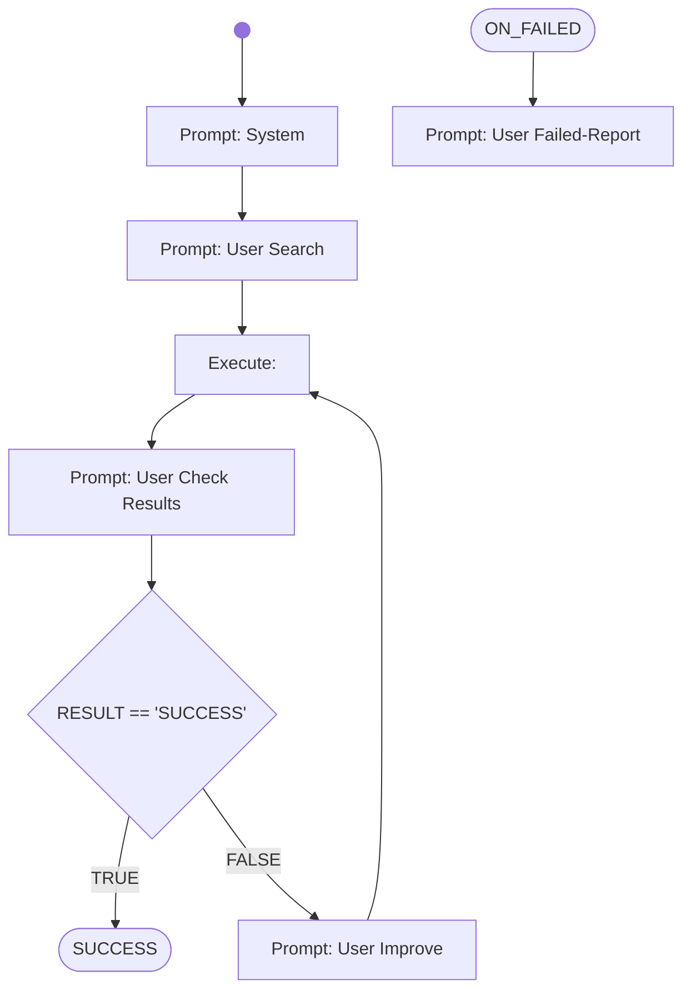

# Lesson 3 - Search the web

AI CodeMentor Tutorial: Write your own Workflow - [Lesson 3](../../docs/tutorial/lesson3.md)

Try it out! From the project directory run:

on Windows:
```shell
bin\run_codementor.ps1 workflows/tutorial/lesson3.wf.md
```
on Linux:
```shell
bin\run_codementor.ps1 workflows/tutorial/lesson3.wf.md
```


# Workflow



# Prompts

## System

You are a helpful assistant.

You will generate shell commands for the specified tasks, which will be executed directly in a linux container provided with the necessary command-line tools.
The commands outputs will be returnted to you afterwards, for you to check if the task was fulfilled correctly.

Your special task will be to search the internet and list the found results.

Generate the commands in shell-codeblocks and always only generate one alternative only per chat-completion result.

## User Search

Use DuckDuckGo to search for articles about "AI Agents" and list the link of the found results. Use search engine API rather than the URLs used for web-browsers. You may use curl or lynx to do it.

## User Check Results

Your generated commands have been executed and the output is now shown to you.

If the output shows, that the web-search was successful and returned results, then just answer with the word "SUCCESS" in the first line.
If the output shows, that the command did not work as expected and there are no results, then just answer with the word "FAILED" in the first line.

In the following lines of your answer summarize with only a few sentences the outcome of your activities and state the paths result links found until now.

The console output of your generated commands are:
```shell
{{RESULT}}
```

## User Improve

Your previous suggestions of commands failed to use the web search.
Try it again use a different approach.

## User Failed-Report

Your previous commands failed, see the results:
{{RESULT}}

Write a short summary about the issue.
Any ideas how to fix the problem?
