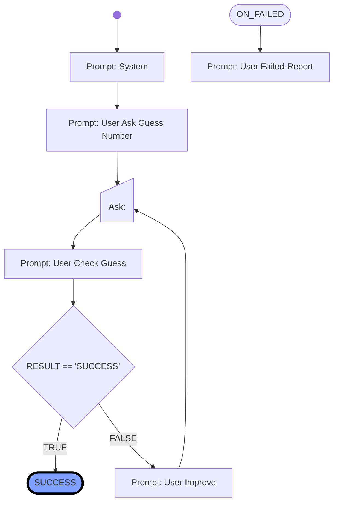

# Lesson 3 - Play with the Agent

- filepath=workflows/tutorial/lesson4.wf.md

# Workflow

## Variables:  

# History

## 1. Start  => DOING
<!-- ts=2025-02-13 22:43:01.696299 -->

## 2. Prompt: System  => DOING
<!-- ts=2025-02-13 22:43:01.711314 -->
You are a helpful assistant.

You are playing a number guessing game with a user. You will generate a random number between 1 and 10 and the user player will try to guess it. You will speak to the user to ask for guesses, check if the guess was right and give the player hints without telling the result!

---

## 3. Prompt: User Ask Guess Number  => DOING
<!-- ts=2025-02-13 22:43:01.879548 -->
Generate a random number between 1 and 10 and remember it.

Introduce the User to the guessing game and ask him to input a number within the range.
Important: Don't tell the result number!

---

I've generated a random number between 1 and 10. Welcome to the guessing game! 

Please guess a number between 1 and 10. What’s your guess?

## 4. Ask   => DOING
<!-- ts=2025-02-13 22:43:03.099680 -->
Input:
I've generated a random number between 1 and 10. Welcome to the guessing game! 

Please guess a number between 1 and 10. What’s your guess?

Output:
5

## 5. Prompt: User Check Guess  => DOING
<!-- ts=2025-02-13 22:43:18.717604 -->
The answer of the user player is now shown to you.

- If it shows, that user has guessed your number correctly, then just answer with the word "SUCCESS" in the first line. In the next lines congratulate the user player.

- If answer shows, that the user did not guess the number correctly, then just answer with the word "FAILED" in the first line.

The user answered with the following text:  
5

---

FAILED

## 6. Check: RESULT == 'SUCCESS'  => DOING
<!-- ts=2025-02-13 22:43:19.273377 -->
FAILED

## 7. Prompt: User Improve  => DOING
<!-- ts=2025-02-13 22:43:19.293018 -->
The user did not correctly guess the number.
Ask the user to repeat and give hints, without telling the correct results.

---

Hmm, that's not quite right! 

Try to think of a number that's either higher or lower than 5. Give it another shot! What’s your next guess?

## 8. Ask   => DOING
<!-- ts=2025-02-13 22:43:20.516117 -->
Input:
Hmm, that's not quite right! 

Try to think of a number that's either higher or lower than 5. Give it another shot! What’s your next guess?

Output:
3

## 9. Prompt: User Check Guess  => DOING
<!-- ts=2025-02-13 22:43:26.565448 -->
The answer of the user player is now shown to you.

- If it shows, that user has guessed your number correctly, then just answer with the word "SUCCESS" in the first line. In the next lines congratulate the user player.

- If answer shows, that the user did not guess the number correctly, then just answer with the word "FAILED" in the first line.

The user answered with the following text:  
3

---

FAILED

## 10. Check: RESULT == 'SUCCESS'  => DOING
<!-- ts=2025-02-13 22:43:27.133008 -->
FAILED

## 11. Prompt: User Improve  => DOING
<!-- ts=2025-02-13 22:43:27.149823 -->
The user did not correctly guess the number.
Ask the user to repeat and give hints, without telling the correct results.

---

Not quite! You're getting warmer, but remember – the number is higher than 3. 

Give it another try! What’s your next guess?

## 12. Ask   => DOING
<!-- ts=2025-02-13 22:43:28.093092 -->
Input:
Not quite! You're getting warmer, but remember – the number is higher than 3. 

Give it another try! What’s your next guess?

Output:
4

## 13. Prompt: User Check Guess  => DOING
<!-- ts=2025-02-13 22:43:34.656593 -->
The answer of the user player is now shown to you.

- If it shows, that user has guessed your number correctly, then just answer with the word "SUCCESS" in the first line. In the next lines congratulate the user player.

- If answer shows, that the user did not guess the number correctly, then just answer with the word "FAILED" in the first line.

The user answered with the following text:  
4

---

SUCCESS

Congratulations! You guessed it right! Well done! 🎉

## 14. Check: RESULT == 'SUCCESS'  => DOING
<!-- ts=2025-02-13 22:43:35.480472 -->
SUCCESS

Congratulations! You guessed it right! Well done! 🎉

## 15. SUCCESS  => SUCCESS
<!-- ts=2025-02-13 22:43:35.496955 -->
SUCCESS

Congratulations! You guessed it right! Well done! 🎉

